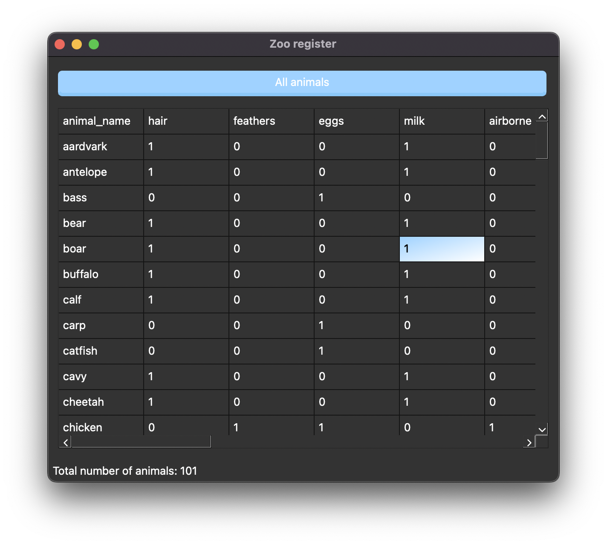
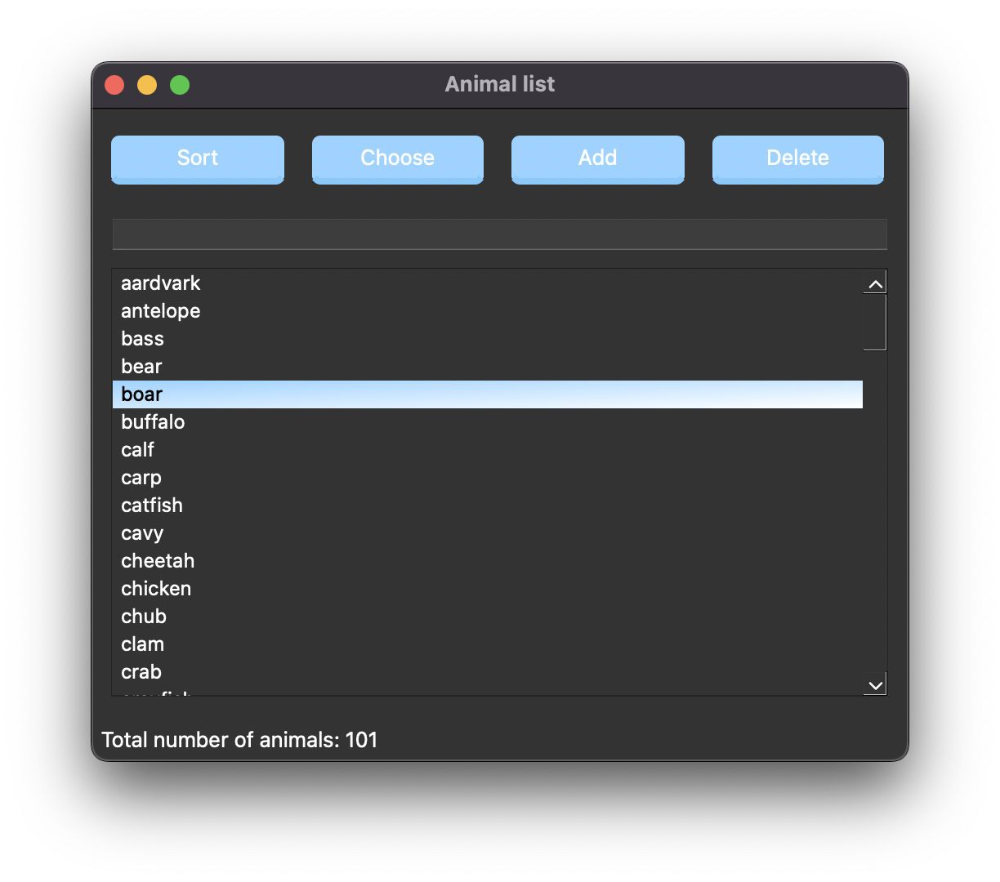
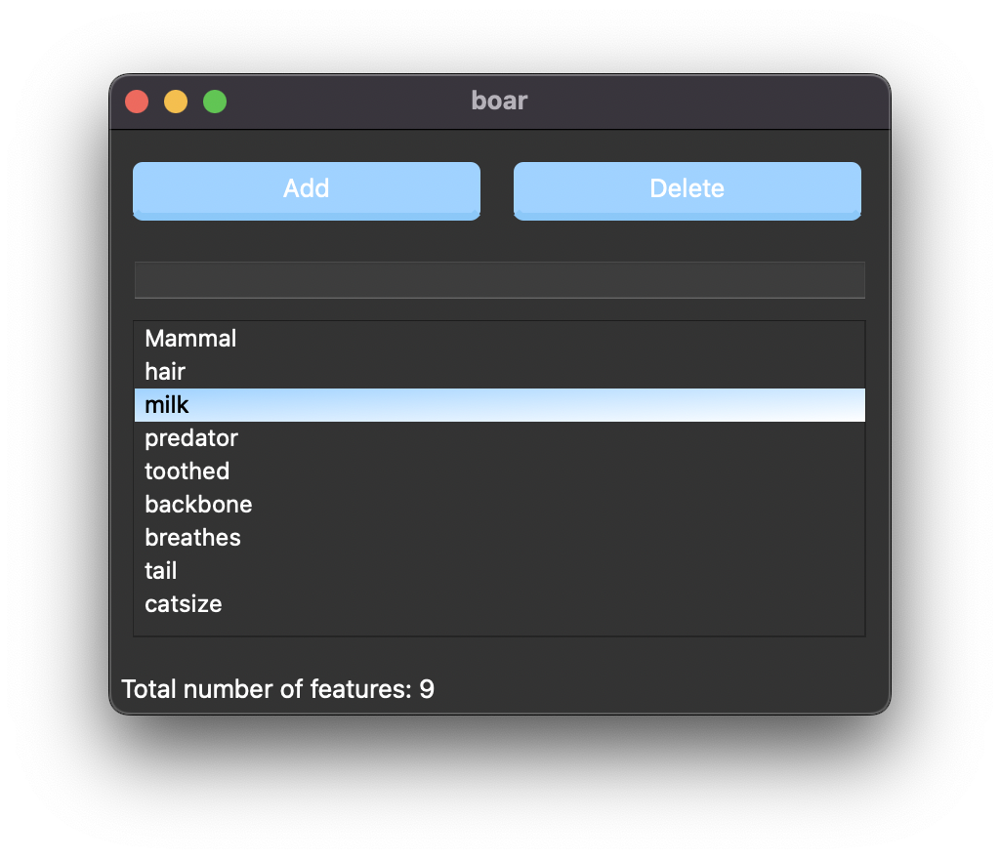

# Zoo register report

**Author:** Zakharov Artem, 211-2
**Submission date:** June 13th, 2022
**Supervisor:** Shershakov Sergey Andreevich<3

# Problem
Create a zoo register of animals containing their features using Qt creator. The application must obtain such functions like: display whole list of animals, add and delete instances, save and load file with all information about animals. 

# Project specification 
Link to the specification: https://disk.yandex.ru/i/lqlaN9sXDfMzWg

# Implementation details
Link to the git repository: https://github.com/Artem00323/dsba-itop2022-hw

I was following the basic possible structure and implementing general functions from the task. Also, I was trying to stick to the given interface, editing only positions of some buttons and visual part (with css). 

Talking about the code itself, it is pretty simple written without any complex structures. Several cpp files for different windows were created. Signal-slot method was used to connect windows and transmit information between them. 

The major problem was to implement the second csv file with animals’ classes. So, my decision was to read information from it straightforwardly, without opening it using “open file” button.

There were several places, where I decided to take different approach:
-	I decided to avoid “edit” button in “animInfo” window, which illustrates features of certain animal and use “delete” and “add” buttons instead.
-	The method of choosing animal in order to see its features. I used “choose” button, however, I think that the author has meant double-click in his approximate interface.

**Project structure**

-	cmake-build-debug
-	resources		(a folder which contains datasets and images for some buttons)
  -	datasets
    -	class.csv 		(csv file with classes of all animals)
    - zoo.csv 		(csv file with main table of all animals and features)
  -	img
    -	about_img.png 		(image for “about” button)
    -	logo.png 			(image with logo)
    -	logosize.png 			(same logo, but resized for the “about” win)
    -	open_img.png 		(image for “open” button)
    -	saveas_img.png 		(image for “save as” button)
  -	resource.qrc
-	CMakeList.txt
-	CmakeList.txt.user
-	aboutpage.cpp 		(a cpp file for aboutpage.ui)
-	aboutpage.h
-	aboutpage.ui 		(a window with logo, author’s name and name of project)
-	animal.cpp 		(a cpp file for animal.ui)
-	animal.h
-	animal.ui 			(a window with list of all animals)
-	animinfo.cpp 		(a cpp file for animinfo.ui)
-	animinfo.h
-	animinfo.ui 		(a window with all features of certain animal)
-	main.cpp			(file which starts the program)
-	mainwindow.cpp 		(a cpp file for mainwindow.ui)
-	mainwindow.h
-	mainwindow.ui 		(a main window with the table of all animals and features)

# How it works

**Main window**

On the main window table with all animals and its features is illustrated. Using double-click the parametres could be changed. Additionally, if you click on any cell of the table, it will be highlighted:). In the status bar the total number of animals is presented. Also, it is hard to show on mac, but there are two buttons in menu bar: “file” with options (“open” and “save as”) and “about”, which opens a page with name of author, project and logo. The button “All animals” opens a window with list of all animals. 

**Animal list**
 
On the animal list window there are 4 buttons. The first one is “sort”, which sorts in ascending and descending order (first click is ascending order and second is descending). The second button is “choose” you click on the animal in the list and click choose, so the program opens an information about this animal with all features and its class. The third button is “add”. You type any word in “textedit” line and press “add”, then the word, which was typed is added to the list of all animals. The last button is “delete”, which deletes the chosen (by click on it) animal. And the number of all animals in status bar. All the changes in “animal list” are directly send to the main table in the mainwindow.

**Animal Info**

The animal info window shows all the class of the animal on the first place, then all its features. Additionally, the name of the window is always changed to the animal, which was chosen and about which the information on this window is. Finally, the total number of features. “add” button: you type any word in “textedit” line and press “add”, then the word, which was typed is added to the list of all animals. The button “delete” deletes the chosen (by click on it) feature.

# Results

The GUI application was created following all the requirements. However, additional part was not done. Some differences in the interface and functionality were not avoided.

# Conclusion
Hereinafter, some improvements in functionality (more features) could be added. On top of that, the better interface could be implemented.
